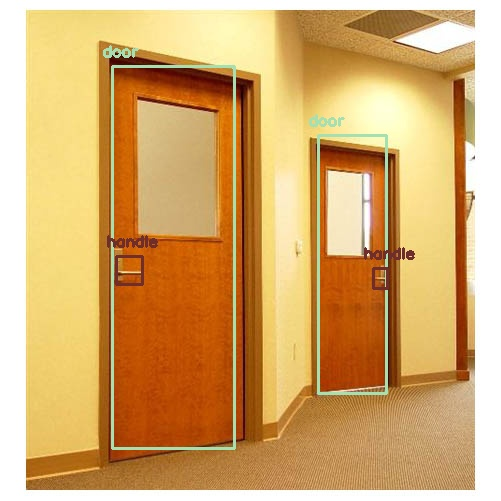

# DoorDetector

A door detector based on yolo implemented by OpenCV.

This repository is based on the contribution of [MiguelARD/DoorDetect-Dataset](https://github.com/MiguelARD/DoorDetect-Dataset) and [arunponnusamy/object-detection-opencv](https://github.com/arunponnusamy/object-detection-opencv).

## Usage

1. Install python requirements.

    Mainly opencv-python

2. Download weight file and put it in the root directory.

    Download [here](https://drive.google.com/open?id=1i9E9pTPN5MtRxgBJWLnfQl2ypCv92dXk).

3. Run with image, video or webcam.

    Examples can be seen in the .bat file. The meaning of args can be found in python file.